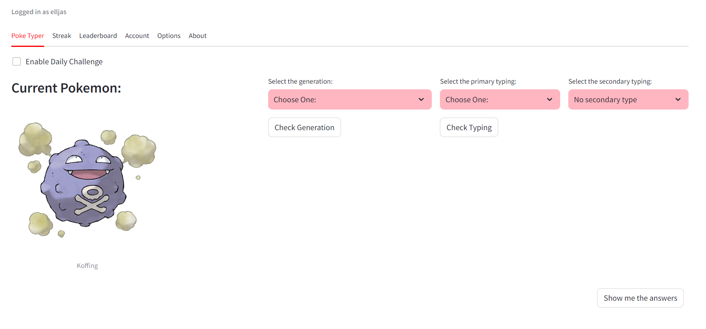
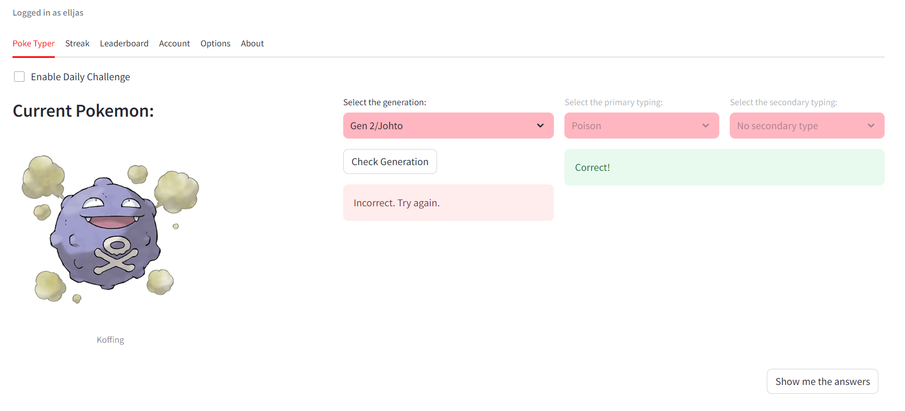
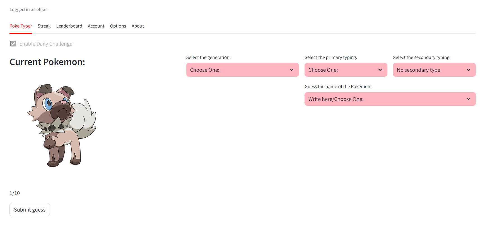
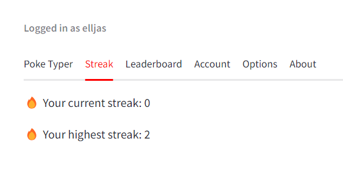
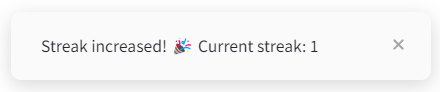
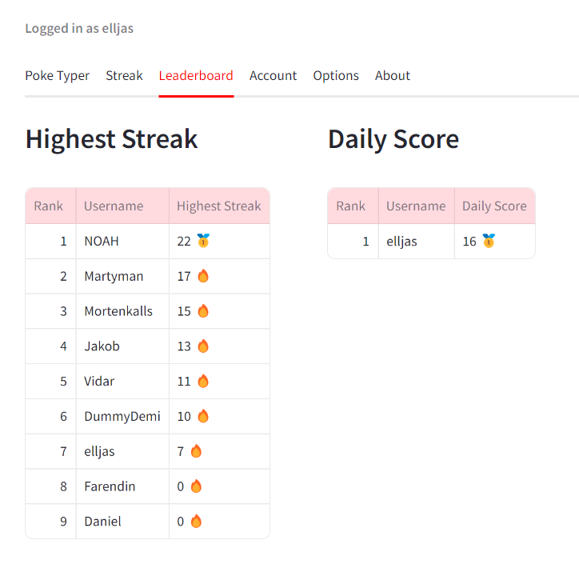
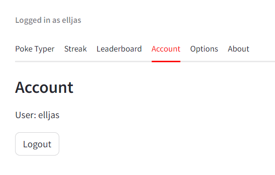
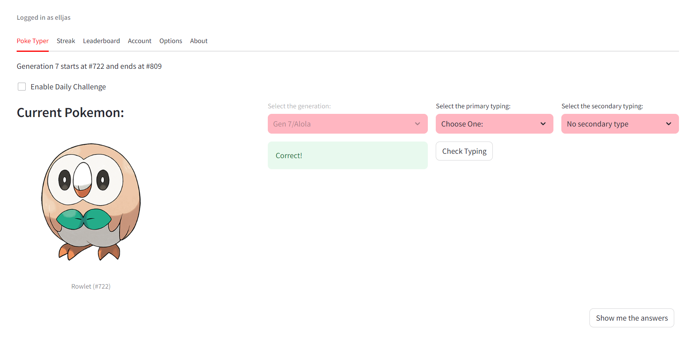
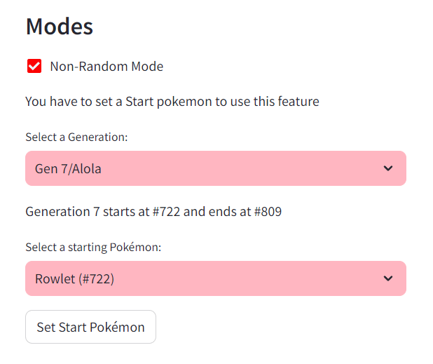
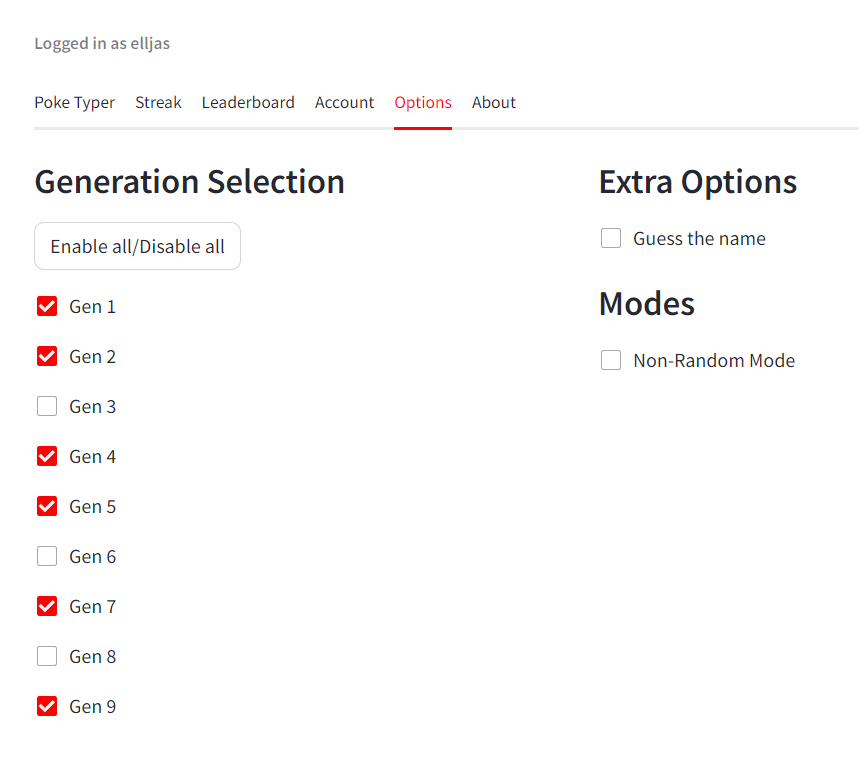

# Poke Typer

Preview:

# Features

### Generation and Type Guessing:

When you visit the site, you will be presented with a random Pokémon image.
Select the generation and type (both primary and secondary) from the dropdown menus.
Click on "Check Generation" and "Check Typing" to see if your guesses are correct.
If you have enabled "Guess the name" mode, you can also try to guess the name of the Pokémon.

### Daily Challenge:

Log in to participate in the daily challenge.
Each day, you get a set of 10 Pokémon to guess.
Your scores for the daily challenge are saved and can be viewed on the leaderboard.
Once you've completed the challenge, your score will be saved for that day.

### Streaks:

You can build a streak by continuously guessing correctly on the first try.
Your current streak and highest streak are displayed in the "Streak" tab.

**_Note: Streaks are only counted when all generations are enabled and no extra options or modes are enabled._**

### Leaderboards:

The "Leaderboard" tab shows the highest streaks and daily scores of all users.
Compete with others to see who knows the most about Pokémon!

### Account Management:

Create an account, log in, and save your progress.

### Non-Random Mode:

In the "Options" tab, you can enable "Non-Random Mode" to start with a specific Pokémon and proceed sequentially.
Select the starting generation and the specific Pokémon to start from.
This mode is helpful for structured learning through the Pokédex.

### Options Customization:

Enable or disable specific generations, toggle the non-random mode and toggle the guess the name option.

### Inspiriation

I made this site to train for sites such as Pokedoku. On Pokedoku, it is crucial to know the typing and generation of Pokémon. That is why I wanted to make a site where you could guess the generation, typing, and name of a Pokémon. Try it out: [Pokedoku](https://pokedoku.com)

### About the Project

I made this site as a fun side-project. The site tests your knowledge of the generation and type of various Pokémon. This is made with Python using the Streamlit framework. The website is hosted by Render.

I used web scraping to get the data of the Pokémon from the website: [Pokémon Database](https://pokemondb.net/pokedex/national) and saved it in a pokemon.db file.
