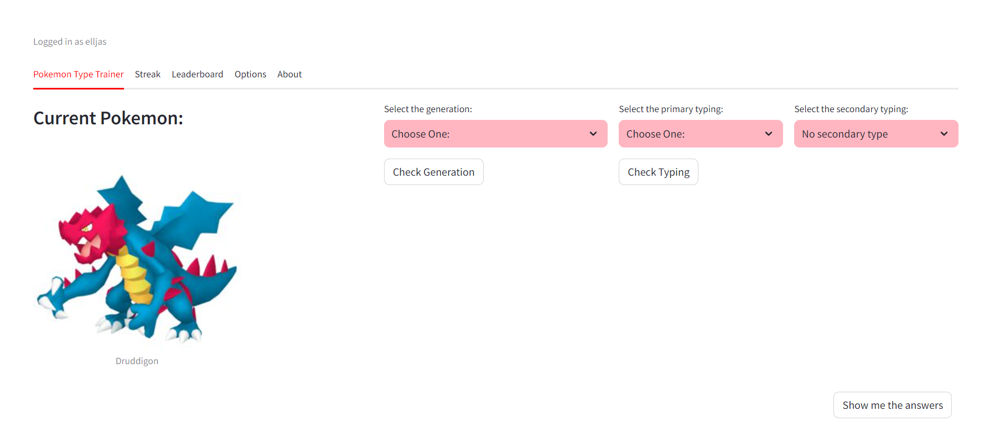

Check out the site: https://pokemonprep.onrender.com (Disclaimer: Loading the site may take a minute or two)

Preview:

I made this site as a fun side-project. The site tests you if you know the generation and type of a pokemon. This is made with python using the streamlit framework. Website is hosted by render.

I used web scraping to get the data of the pokemon from the website: https://pokemondb.net/pokedex/national and saved it in a pokemon.db file.

I got this idea from doing the daily "pokemon soduko" https://pokedoku.com. On pokedoku it is very helpful to know the generation and type of the pokemon, so I made this site to help me with that.
