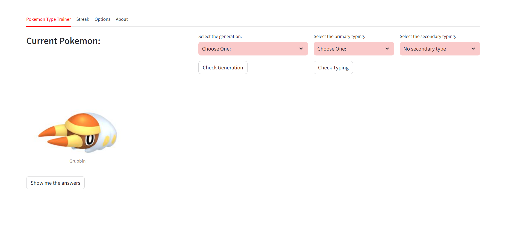

Check out the site: https://pokemonprep.onrender.com

Preview:

I made this site as a fun side-project. The site tests you if you know the generation and type of a pokemon. This is made with python using the streamlit library. Website is hosted by render.

I also used web scraping to get the data of the pokemon from the website: https://pokemondb.net/pokedex/national and saved it in the pokemon.db file. The data is then used to test the user.

I got this idea from doing the "pokemon soduko" https://pokedoku.com and to be better at it, I need to know the generation and type of the pokemon. So I made this site to help me with that.
